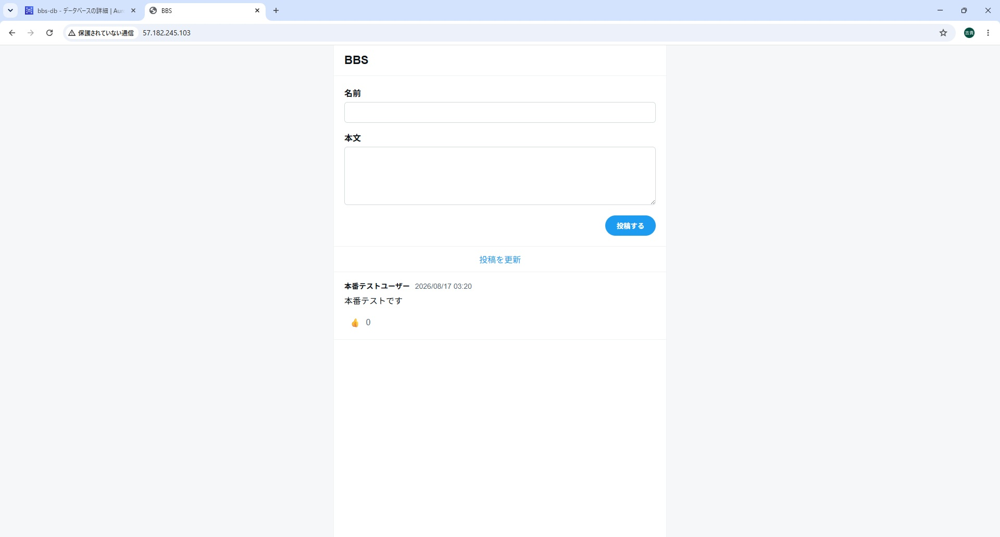
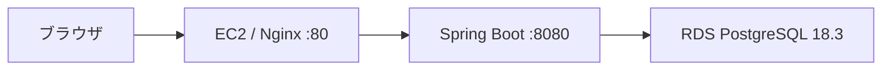

# bbs

Java／Spring Bootで作成した、シンプルな掲示板Webアプリケーションです。

名前と本文を入力して投稿し、投稿一覧の表示やいいねの追加・取り消しができます。JUnitによる単体テストを実施し、AWS EC2・RDSを利用して公開しています。

## 公開URL

[http://57.182.245.103/](http://57.182.245.103/)

> 現在はHTTPで公開しています。EC2を停止・開始した場合、パブリックIPv4アドレスが変更される可能性があります。

## 画面



## 主な機能

- 投稿の登録
- 投稿の新しい順での一覧表示
- 名前・本文の入力バリデーション
- 投稿一覧の再読み込み
- いいねの追加・取り消し
- セッション単位でのいいね状態管理
- CSRF対策
- スマートフォン向けレイアウト

## システム構成



- Nginxが80番ポートでリクエストを受け付け、Spring Bootの8080番ポートへ転送します。
- Spring Bootアプリケーションはsystemdサービスとして常駐させています。
- RDSはパブリックアクセスを無効にし、EC2からのみ接続できる構成です。
- DB接続情報は環境変数で管理し、Gitリポジトリには保存していません。

## 使用技術

| 分類 | 技術 |
|---|---|
| 言語 | Java 25、JavaScript |
| フレームワーク | Spring Boot 4.1.0 |
| Web | Spring MVC、Thymeleaf |
| セキュリティ | Spring Security、CSRF対策 |
| データアクセス | Spring Data JPA、Hibernate |
| データベース | PostgreSQL 18 |
| テスト | JUnit 5、Mockito、MockMvc |
| ビルド | Maven |
| インフラ | AWS EC2、Amazon RDS |
| OS・Webサーバー | Amazon Linux 2023、Nginx |

## テスト

Service層ではRepositoryをモック化し、Controller層ではServiceをモック化して単体テストを実施しています。

- `PostServiceTest`：6件
- `PostControllerTest`：7件
- 合計：13件

```powershell
.\mvnw.cmd test
```

確認結果：

```text
Tests run: 13, Failures: 0, Errors: 0, Skipped: 0
BUILD SUCCESS
```

## ローカル実行

### 前提環境

- Java 25
- PostgreSQL 18
- Maven Wrapper
- `bbs`データベースを作成済みであること

PostgreSQLのパスワードを環境変数へ設定します。

```powershell
$env:DB_PASSWORD = "PostgreSQLのパスワード"
```

アプリケーションを起動します。

```powershell
.\mvnw.cmd spring-boot:run
```

ブラウザで以下へアクセスします。

```text
http://localhost:8080/
```

## 本番環境設定

本番環境では`prod`プロファイルを使用します。

```text
src/main/resources/application-prod.properties
```

次の環境変数からRDS接続情報を取得します。

| 環境変数 | 内容 |
|---|---|
| `DB_URL` | RDSのJDBC URL |
| `DB_USERNAME` | RDSのユーザー名 |
| `DB_PASSWORD` | RDSのパスワード |

起動例：

```bash
java -jar bbs.jar --spring.profiles.active=prod
```

実際のEC2環境ではsystemdサービスとして起動し、Nginxをリバースプロキシとして使用しています。

## ブランチ運用

```text
main
└─ develop
   └─ feature/*
```

- `main`：安定版・公開用
- `develop`：開発内容の統合用
- `feature/*`：機能単位の作業用

作業ブランチは最新の`develop`から作成します。

```bash
git switch develop
git pull --rebase origin develop
git switch -c feature/<機能名>
```

Pull Request作成前に、最新の`develop`へrebaseします。

```bash
git fetch origin
git rebase origin/develop
```

rebase前に作業ブランチをpushしていた場合は、次の方法で更新します。

```bash
git push --force-with-lease origin feature/<機能名>
```

`feature/*`から`develop`へのPull Requestは、`Rebase and merge`で反映します。

開発完了後は、Fast-forward可能な場合のみ`develop`を`main`へ反映します。

```bash
git switch main
git fetch origin
git merge --ff-only origin/develop
git push origin main
```

## Documents

開発時の設定、実装内容、テスト結果、AWS公開手順は以下に記録しています。

- [開発備忘録](docs/dev-notes.md)