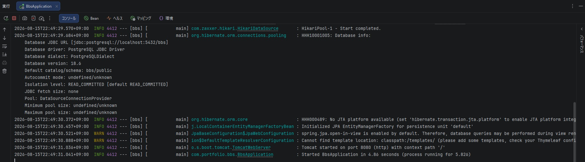
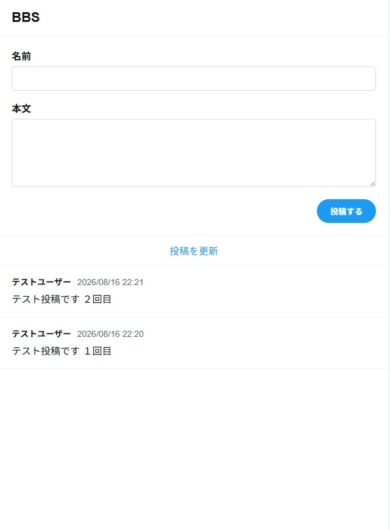
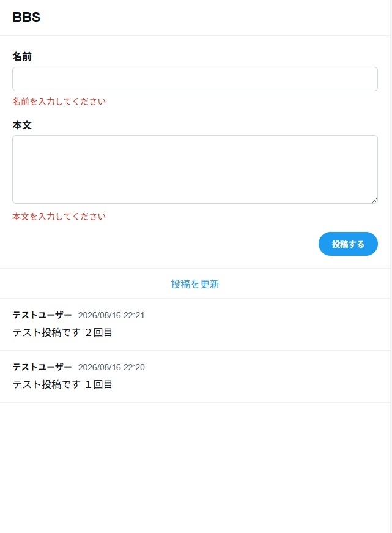

## Spring Bootプロジェクト作成

Spring Initializrを使用して、Spring Bootプロジェクトを作成した。


## IntelliJ IDEA設定

Project SDKおよびLanguage LevelにJava 25を設定した。


### Git差分確認

IntelliJ IDEAのGit機能を利用し、変更内容の差分が表示されることを確認した。


## PostgreSQL設定

PostgreSQL 18をローカル開発環境に導入し、掲示板アプリケーション用のデータベースを作成した。

- Database: bbs
- Port: 5432
- User: postgres

Spring BootのDB接続パスワードは環境変数 `DB_PASSWORD` から取得する。

```properties
spring.datasource.url=jdbc:postgresql://localhost:5432/bbs
spring.datasource.username=postgres
spring.datasource.password=${DB_PASSWORD}
spring.jpa.hibernate.ddl-auto=update
spring.jpa.show-sql=true
```

### 接続確認

Spring Boot起動時にPostgreSQLへの接続およびJPAの初期化が正常に完了することを確認した。



### テーブルの自動作成

本アプリでは、以下の設定によってHibernateがエンティティの定義とデータベースの状態を比較し、必要なテーブルをアプリ起動時に作成・更新する。

```properties
spring.jpa.hibernate.ddl-auto=update
```

`Post`エンティティに対応するテーブルが存在しない場合、アプリ起動時にPostgreSQL上へ `posts` テーブルが自動作成される。そのため、pgAdminからテーブル作成SQLを手動で実行しなくても投稿を登録できる。

pgAdminはPostgreSQLのテーブルを作成しているのではなく、PostgreSQLの状態を確認・操作するための管理ツールである。自動作成されたテーブルが表示されない場合は、pgAdminの `Tables` を更新して確認する。

`ddl-auto=update`はローカル開発では便利だが、エンティティの変更に応じてDB構造が自動更新される。本番環境では意図しない変更を避けるため、SQLやマイグレーションツールによる明示的な管理を検討する。


## 投稿機能の実装

投稿フォームと投稿一覧は、画面遷移を増やさず `index.html` に集約した。

投稿処理は以下の構成とした。

```text
GET /
→ 投稿フォームと投稿一覧を表示

POST /posts
→ 入力値を検証
→ 投稿を登録
→ GET / へリダイレクト
```

投稿登録後に同じ画面を直接返すと、ブラウザの再読み込みによって同じ内容が再送信される可能性がある。そのため、登録後はトップ画面へリダイレクトするPRGパターンを採用した。

### 入力バリデーション

画面側の入力制限だけでは、直接送信されたリクエストを検証できない。そのため、`PostForm` にBean Validationのアノテーションを設定し、サーバー側でも以下を検証する構成とした。

* 名前が入力されていること
* 名前が50文字以内であること
* 本文が入力されていること
* 本文が500文字以内であること

入力エラーがある場合は投稿を登録せず、入力内容と投稿一覧を保持した状態で `index.html` を再表示する。

### 投稿一覧の表示順

投稿は新しいものから順に表示する。

作成日時が同じ投稿の表示順も一定になるよう、作成日時の降順に加えてIDの降順を指定した。

```java
findAllByOrderByCreatedAtDescIdDesc()
```

### Service層とトランザクション

ControllerからRepositoryを直接呼び出さず、Service層を経由して投稿の参照と登録を行う構成とした。

参照処理には `@Transactional(readOnly = true)`、登録処理には `@Transactional` を設定し、DB処理の単位をService層で管理している。

### 画面構成

Xの中央カラムを参考に、投稿フォームと投稿一覧を縦方向に表示する1カラム構成とした。

現時点では以下の機能に絞っている。

* 投稿フォーム
* 投稿一覧
* 投稿一覧の更新
* 入力エラーの表示
* スマートフォン向けのレイアウト調整

新着件数の自動取得は実装せず、更新ボタンからトップ画面を再読み込みすることで最新の投稿を取得する。

### 動作確認

投稿した内容がデータベースへ登録され、新しい投稿から順に表示されることを確認した。



名前と本文が未入力の場合、投稿処理を行わず、入力エラーが画面に表示されることを確認した。

