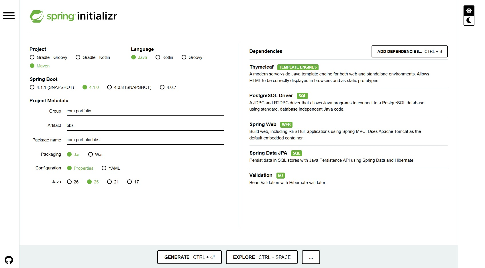
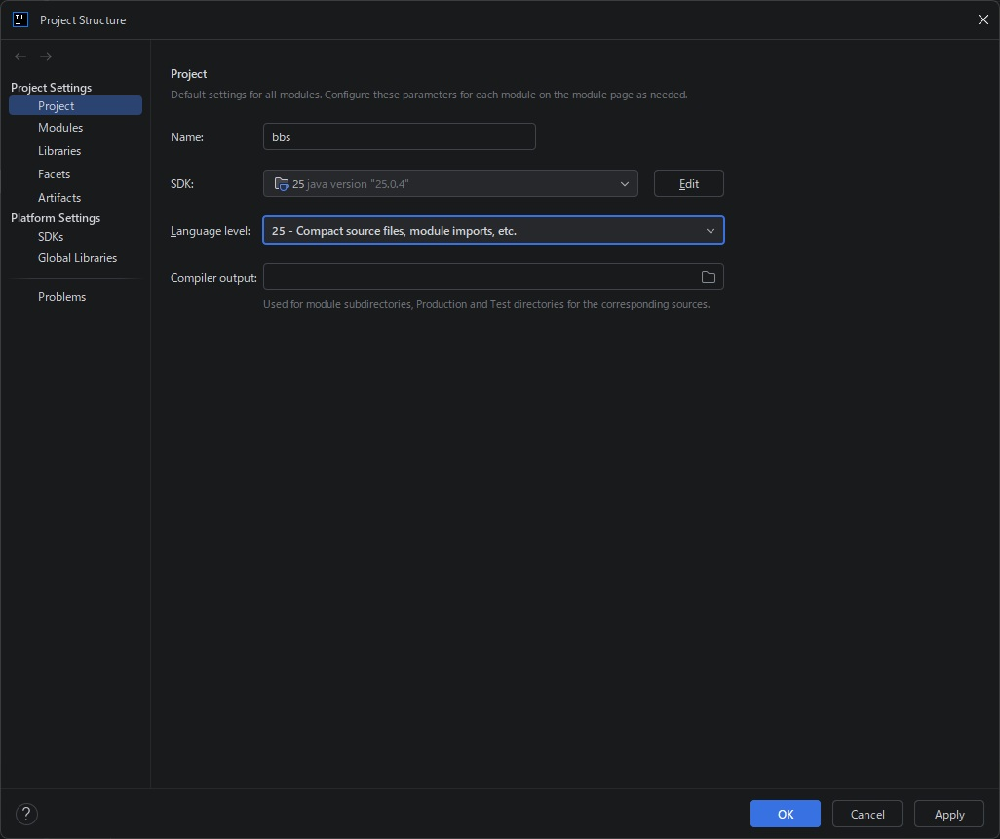
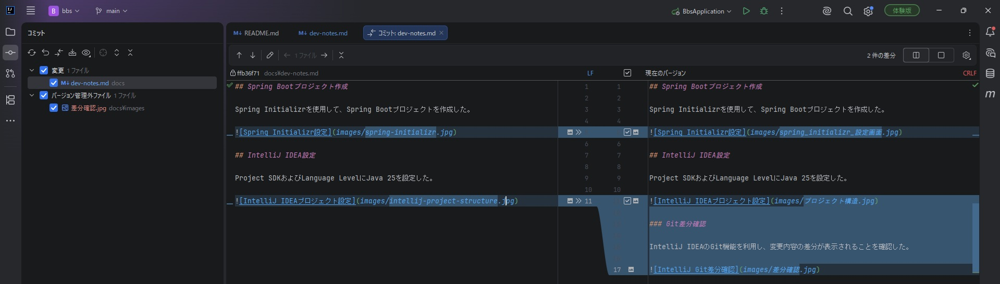

## Spring Bootプロジェクト作成

Spring Initializrを使用して、Spring Bootプロジェクトを作成した。

## IntelliJ IDEA設定

Project SDKおよびLanguage LevelにJava 25を設定した。

### Git差分確認

IntelliJ IDEAのGit機能を利用し、変更内容の差分が表示されることを確認した。

